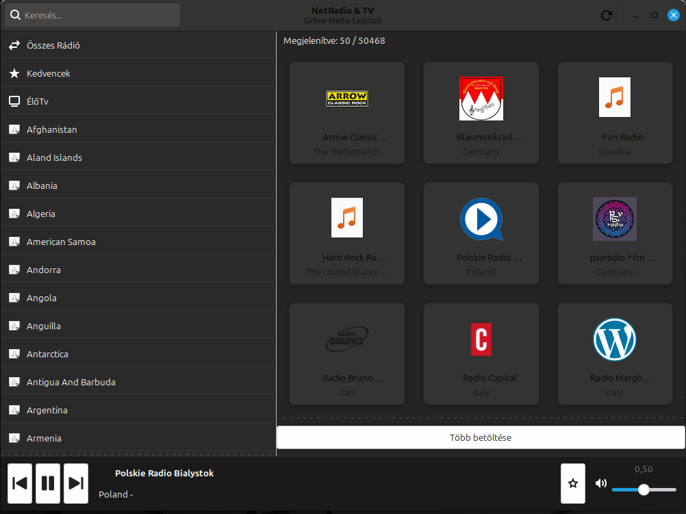
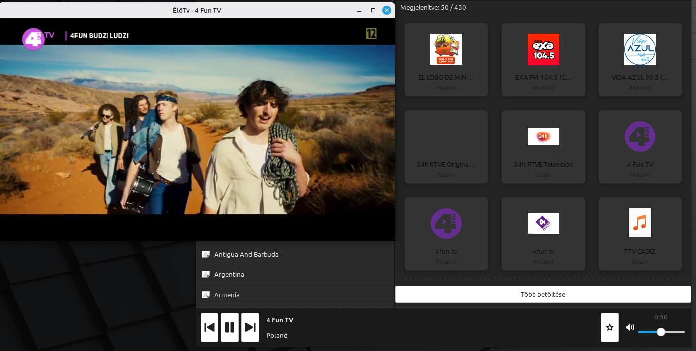

# 📻 NetRadio & TV (formerly GladeRadio)


**The Ultimate Online Radio & IPTV Player for Linux Desktops.**

**NetRadio & TV** is a modern, lightweight, and feature-rich streaming application built with **Python** and **GTK3**. It leverages the massive [Radio Browser](https://www.radio-browser.info/) database to provide access to over **100,000 radio stations** and thousands of **Live TV channels** from around the world.

Designed for Linux users who want a seamless multimedia experience without the bloat of web browsers.

---

## ��🇺 Magyar Leírás (Hungarian Description)
**Modern, gyors és könnyű online rádió- és tévélejátszó Linux rendszerekre.**
A NetRadio & TV egy Python és GTK3 alapú alkalmazás, amely több mint **100.000 rádióadóhoz** és számos **TV csatornához** biztosít hozzáférést. Támogatja a kedvenceket, a videó lejátszást (IPTV), és a teljes képernyős módot.

---

## ✨ Key Features

*   🌍 **Massive Library:** Access 100,000+ radio stations and TV channels globally via the Radio Browser API.
*   📺 **Live TV & IPTV Support:** Watch live television streams directly in the app. Supports **HLS (.m3u8)**, **DASH**, and other modern streaming formats.
*   🎥 **Video Overlay & Fullscreen:** Dedicated video window for TV channels with **double-click fullscreen** support.
*   🚀 **Smart Stream Handling:**
    *   Automatic detection of video streams in playlists.
    *   **Asian TV Fix:** Special handling for CCTV/CETV and AliCDN streams to ensure video playback instead of audio-only.
    *   **Buffering Control:** Optimized for smooth playback even on slower connections.
*   ⭐ **Favorites Manager:** Save your favorite stations for quick access.
*   🔍 **Advanced Search:** Filter by name, country, tag, or language.
*   🎨 **Modern Dark UI:** Sleek, eye-friendly dark theme built with GTK3.
*   🎧 **Metadata Support:** Displays song titles, artist information, and station logos.

## 📸 Screenshots



## 📥 Installation

### 📦 Debian / Ubuntu / Linux Mint (.deb)

Download the latest `.deb` package from the [Releases](https://github.com/szaturnusz/GladeRadio/releases) page.

```bash
sudo dpkg -i gladeradio_1.0.0_all.deb
sudo apt-get install -f  # Fix missing dependencies if any
```

### 🔧 From Source (Developer Setup)

1.  **Install Dependencies:**
    ```bash
    sudo apt install python3-gi python3-requests python3-pil gir1.2-gtk-3.0 gir1.2-gstreamer-1.0 gstreamer1.0-plugins-good gstreamer1.0-plugins-bad gstreamer1.0-plugins-ugly gstreamer1.0-libav
    ```

2.  **Clone & Run:**
    ```bash
    git clone https://github.com/szaturnusz/GladeRadio.git
    cd GladeRadio
    python3 main.py
    ```

### 🪟 Windows Build

To build the application for Windows, you need to have Python and `PyInstaller` installed.

1.  **Install MSYS2:**
    Download and install [MSYS2](https://www.msys2.org/).
    Open `MSYS2 MinGW 64-bit` terminal and install GTK3 and GStreamer dependencies:
    ```bash
    pacman -S mingw-w64-x86_64-gtk3 mingw-w64-x86_64-python-gobject mingw-w64-x86_64-python-requests mingw-w64-x86_64-python-pillow mingw-w64-x86_64-gstreamer mingw-w64-x86_64-gst-plugins-base mingw-w64-x86_64-gst-plugins-good mingw-w64-x86_64-gst-plugins-bad mingw-w64-x86_64-gst-plugins-ugly mingw-w64-x86_64-gst-libav
    ```

2.  **Install PyInstaller:**
    ```bash
    pip install pyinstaller
    ```

3.  **Build the Executable:**
    Run the following command in the project directory:
    ```bash
    pyinstaller build_windows.spec
    ```
    The executable will be located in the `dist/NetRadioTV` folder.

## 🛠️ Technologies Used

*   **Language:** Python 3
*   **GUI Framework:** GTK+ 3.0 (PyGObject)
*   **Multimedia Engine:** GStreamer 1.0 (Playbin, GstVideo)
*   **Data Source:** Radio Browser API
*   **Packaging:** Debian Package (`dpkg-deb`)

## �� Troubleshooting & Known Issues

*   **Missing Video on TV Channels:** Ensure you have `gstreamer1.0-libav` and `gstreamer1.0-plugins-bad` installed.
*   **CCTV/CETV Channels:** The app includes specific overrides for these channels to use working educational/university mirrors if the primary streams are geo-blocked or audio-only.

## 🤝 Contributing

Contributions, issues, and feature requests are welcome! Feel free to check the [issues page](https://github.com/szaturnusz/GladeRadio/issues).

## 📝 License

This project is open source and available under the [MIT License](LICENSE).

---
*Keywords: Linux Radio Player, IPTV Player Linux, Online TV, Python GTK App, GStreamer Player, Internet Radio, Live Stream, Open Source Multimedia.*
